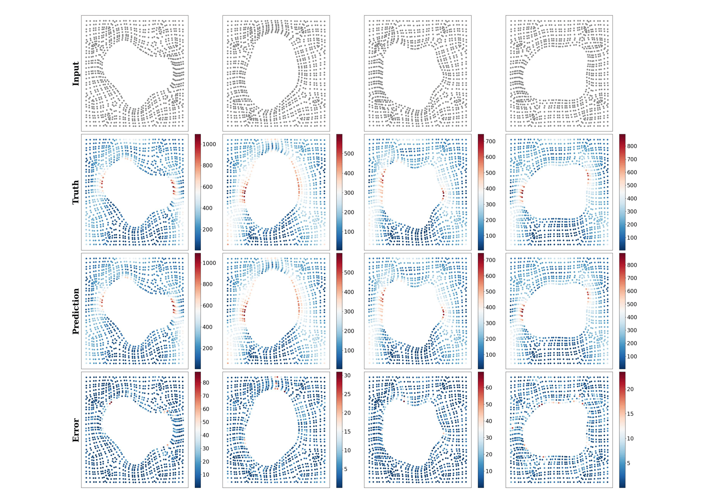

# PI-GANO

This repository is the official implementation of the paper: [Physics-Informed Geometry-Aware Neural Operator](https://www.sciencedirect.com/science/article/pii/S0045782524007941?via%3Dihub), published in Journal of Computer Methods in Applied Mechanics and Engineering. The arxiv version of paper can also be found [here](https://arxiv.org/html/2408.01600v1).
# Sp2GNO

### This repository contains the official implemention of the paper : [Spatio-spectral graph neural operator for solving computational mechanics problems on irregular domain and unstructured grid](https://www.sciencedirect.com/science/article/pii/S0045782524009137). The arxiv version of paper can also be found [here](https://arxiv.org/abs/2409.00604v1).

## Hyperelasticity Problem



## Quick Start

### set up a conda environment

```
conda create -n sp2gno_env python=3.8
conda activate sp2gno_env
sh install.sh
```

### Training for Hyperelasticity Equation

```
python3 train_elas.py
```

## Citation
Find this useful or like this work? Cite us with:
```latex
@article{SARKAR2025117659,
title = {Spatio-spectral graph neural operator for solving computational mechanics problems on irregular domain and unstructured grid},
journal = {Computer Methods in Applied Mechanics and Engineering},
volume = {435},
pages = {117659},
year = {2025},
issn = {0045-7825},
doi = {https://doi.org/10.1016/j.cma.2024.117659},
url = {https://www.sciencedirect.com/science/article/pii/S0045782524009137},
author = {Subhankar Sarkar and Souvik Chakraborty},
keywords = {Operator learning, Graph neural network, Spectral graph neural network, Neural operator, Computational mechanics},
abstract = {Scientific machine learning has seen significant progress with the emergence of operator learning. However, existing methods encounter difficulties when applied to problems on unstructured grids and irregular domains. Spatial graph neural networks utilize local convolution in a neighborhood to potentially address these challenges, yet they often suffer from issues such as over-smoothing and over-squashing in deep architectures. Conversely, spectral graph neural networks leverage global convolution to capture extensive features and long-range dependencies in domain graphs, albeit at a high computational cost due to Eigenvalue decomposition. In this paper, we introduce a novel approach, referred to as Spatio-Spectral Graph Neural Operator (Sp2GNO) that integrates spatial and spectral GNNs effectively. This framework mitigates the limitations of individual methods and enables the learning of solution operators across arbitrary geometries, thus catering to a wide range of real-world problems. Sp2GNO demonstrates exceptional performance in solving both time-dependent and time-independent partial differential equations on regular and irregular domains. Our approach is validated through comprehensive benchmarks and practical applications drawn from computational mechanics and scientific computing literature.}
}
```
